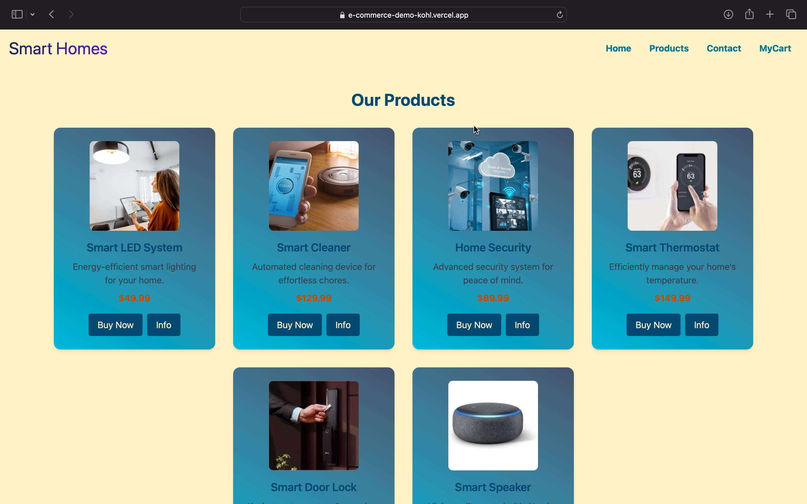
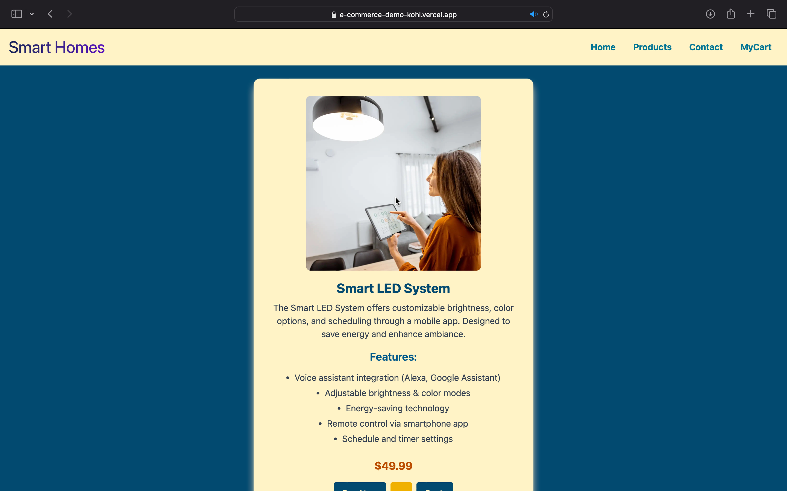
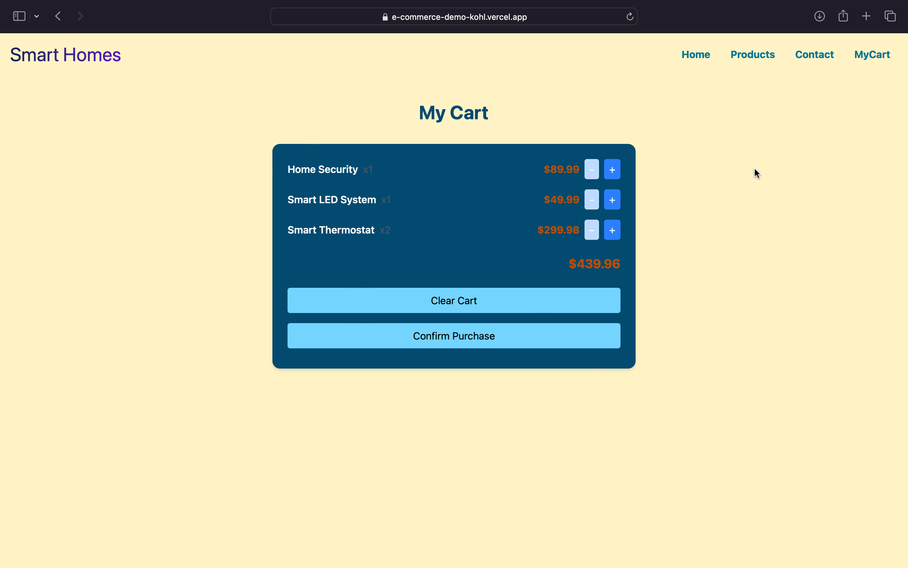

# 🏠 Smart Homes E-Commerce

A modern e-commerce web app for smart home appliances, built with **React**, **Redux Toolkit**, and **Vite**.  
Browse smart products, view details, and manage your cart with a clean, responsive UI.

---

## 🚀 Live Demo
👉 [View the app on Vercel](https://e-commerce-demo-kohl.vercel.app)  

---

## ✨ Features
- 🏠 Home page with category cards  
- 🛒 Products page with add/remove to cart  
- 🛍️ Cart page with quantity controls & persistent cart (localStorage)  
- 📦 Product details page with features & full descriptions  
- 📞 Contact and 📃 Privacy pages  
- 🎨 Responsive design with Tailwind CSS  
- 🔄 Global cart state management using Redux Toolkit  
- 🌐 Routing with React Router  

---

## 📸 Screenshots

### 🏠 Home / Products Page


### Products Page  
 

### 📦 Product Details


### 🛍️ Cart



---

## 🛠️ Tech Stack
- ⚛️ **React** – UI library  
- 🔄 **Redux Toolkit** – State management  
- 🌐 **React Router** – Routing  
- 🎨 **Tailwind CSS** – Styling  
- ⚡ **Vite** – Fast build tool  
- ▲ **Vercel** – Deployment  

---

## Project Structure

```
src/
  components/
    category-card.jsx
    nav.jsx
    myCart.jsx
  pages/
    Home.jsx
    about.jsx
    contact.jsx
    privacy.jsx
    products.jsx
    prduct_info.jsx
  Hooks/
    product_details.js
  redux/
    store.js
    cart.js
  App.jsx
  App.css
```


## Getting Started

### Prerequisites

- [Node.js](https://nodejs.org/) (v18+ recommended)
- [npm](https://www.npmjs.com/) or [yarn](https://yarnpkg.com/)

### Installation

1. **Clone the repository:**
   ```sh
   git clone https://github.com/yourusername/smart-homes-ecom.git
   cd smart-homes-ecom/e-comm
   ```

2. **Install dependencies:**
   ```sh
   npm install
   # or
   yarn install
   ```

3. **Start the development server:**
   ```sh
   npm run dev
   # or
   yarn dev
   ```

4. **Open in browser:**
   Visit [http://localhost:5173](http://localhost:5173) (or the port shown in your terminal).


## Key Technologies

- **React** – UI library
- **Redux Toolkit** – State management
- **React Router** – Routing
- **Tailwind CSS** – Styling
- **Vite** – Fast build tool

## Usage

- **Add products to cart:**  
  Go to the Products page and click "Buy Now". Use "+" and "-" to adjust quantity.
- **Cart persists:**  
  Cart items are saved in your browser (localStorage) and reload on refresh.
- **Checkout:**  
  Go to "MyCart" and click "Confirm Purchase" to clear the cart and see a thank you message.

## Customization

- Add new products in `src/pages/products.jsx`
- Update categories in `src/components/category-card.jsx`
- Change styles in `App.css` or Tailwind classes

## License

MIT

---

**Made with ❤️ using React, Redux Toolkit, and Vite.**
